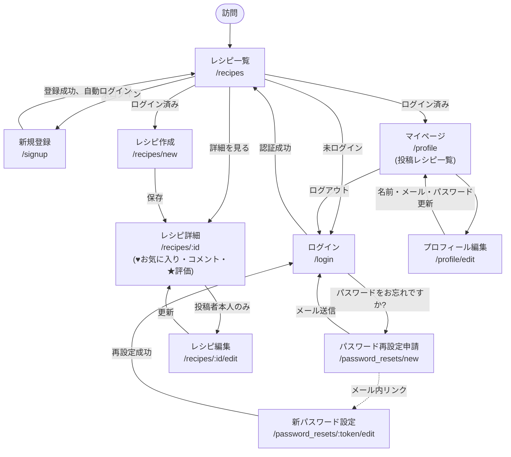
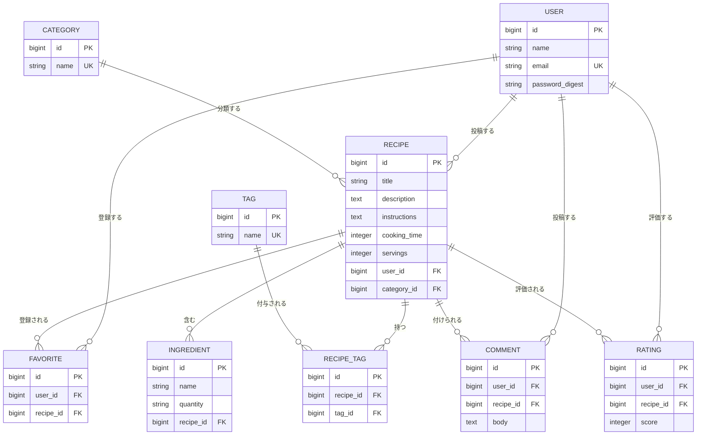

# レシピ管理

自分の作ったレシピを登録・共有できるレシピ管理アプリです。カテゴリやタグでの検索、お気に入り登録、コメント、5段階の星評価に対応しています。

## 主な機能

- **レシピのCRUD**: タイトル・説明・材料(複数追加/削除可)・作り方・調理時間・人数分・写真を登録
- **カテゴリ・タグ**: カテゴリはプルダウン選択、なければその場で新規作成可。タグはカンマ区切りで自由入力(自動で新規作成)
- **検索・絞り込み**: キーワード・カテゴリ・タグでレシピ一覧を絞り込み
- **お気に入り(♥)**: ログインユーザーがレシピをワンクリックでお気に入り登録・解除(ページ遷移なしで即時反映)
- **コメント**: レシピへのコメント投稿・編集・削除(自分のコメントのみ編集・削除可)
- **評価(★5段階)**: レシピを1〜5の星で評価。1人1レシピにつき1件、後から変更可。平均評価を一覧・詳細に表示
- **ユーザー認証**: メールアドレス・パスワードでの新規登録/ログイン(セッションベース、Devise等は未使用)

## 技術スタック

- Ruby 3.3.11 / Rails 7.1
- MySQL 8.0
- Turbo / Stimulus(importmap、JSビルド不要)
- Active Storage(画像アップロード)
- Minitest(テスト)

## 画面遷移図



未ログイン状態では一覧・詳細の閲覧のみ可能。レシピ作成・編集、マイページ、お気に入り・コメント・評価はログインが必須で、`require_login` により未ログイン時は `/login` にリダイレクトされる。お気に入り登録・コメント投稿・★評価はレシピ詳細画面内での操作(Turbo Streamによる部分更新)であり、画面遷移は発生しない。パスワード再設定は、申請フォーム送信後にメールで送られるリンク(トークン付き、有効期限30分)経由で新パスワード設定画面に遷移する(破線の矢印)。

## ER図



`favorites` は `user_id + recipe_id`、`ratings` も `user_id + recipe_id` でユニーク制約があり、1ユーザー1レシピにつき最大1件(お気に入りは有無のみ、評価は1〜5点で上書き更新)。

## 画面モック

主要3画面のワイヤーフレーム(実装済みレイアウトの簡易表現)。

**レシピ一覧 `/recipes`**

```
┌─────────────────────────────────────────────┐
│ レシピ管理        新規レシピ マイページ ○○さん ログアウト │
├─────────────────────────────────────────────┤
│ [検索キーワード] [カテゴリ▾] [タグ▾] [絞り込み] [リセット] │
├─────────────────────────────────────────────┤
│ ┌───────────┐ ┌───────────┐ ┌───────────┐ │
│ │ [写真]      │ │ [写真]      │ │ [写真]      │ │
│ │ タイトル     │ │ タイトル     │ │ タイトル     │ │
│ │ カテゴリ・♥  │ │ カテゴリ・♥  │ │ カテゴリ・♥  │ │
│ │ ★★★★☆     │ │ ★★★☆☆     │ │ ★★★★★     │ │
│ └───────────┘ └───────────┘ └───────────┘ │
└─────────────────────────────────────────────┘
```

**レシピ詳細 `/recipes/:id`**

```
┌─────────────────────────────────────────────┐
│ タイトル                              ♥ お気に入り │
│ [写真]                          ★★★★☆(平均4.2) │
│ カテゴリ / タグ タグ タグ                          │
│ 調理時間: ○分  人数分: ○人                       │
│ 材料 ─────────────                           │
│  ・材料名  分量                                  │
│ 作り方 ─────────────                          │
│  本文                                         │
│ コメント ─────────────                        │
│  ○○さん: コメント本文 [編集][削除]                  │
│  [コメント入力欄............] [投稿]               │
└─────────────────────────────────────────────┘
```

**マイページ `/profile`**

```
┌─────────────────────────────────────────────┐
│ マイページ                                       │
│ お名前: ○○○○                                   │
│ メールアドレス: xxx@example.com                    │
│ [プロフィールを編集]                                │
│ 投稿したレシピ ─────────────                     │
│  ・レシピタイトル (カテゴリ)                         │
│  ・レシピタイトル (カテゴリ)                         │
└─────────────────────────────────────────────┘
```

## API仕様

エンドポイント一覧は [`docs/api/openapi.yaml`](docs/api/openapi.yaml)(OpenAPI 3.0)にまとめている。Swagger Editor([editor.swagger.io](https://editor.swagger.io/))に貼り付けるか、以下でローカルプレビューできる。

```bash
npx @redocly/cli preview-docs docs/api/openapi.yaml
```

このアプリはJSON APIではなくセッションベースのHTMLアプリのため、各エンドポイントのレスポンスは基本的に302リダイレクト or HTMLレンダリング(一部Turbo Streamに対応)。仕様書はフォームのパラメータとレスポンスの挙動を明文化する目的で作成している。

## セットアップ

### Dockerを使う場合(推奨)

```bash
docker compose up
```

初回起動時は別ターミナルでDBを作成・マイグレーションします。

```bash
docker compose exec web bin/rails db:create db:migrate
```

`http://localhost:3000` でアクセスできます。

### デモアカウント

新規登録なしですぐに動作確認したい場合は、以下のアカウントでログインできます。

| ユーザー名 | メールアドレス | パスワード |
| --- | --- | --- |
| ウァッキー | genki@example.com | yoishou86! |
| デモ太郎 | demo1@example.com | demoPass123! |
| デモ花子 | demo2@example.com | demoPass456! |

### ローカル環境で動かす場合

MySQLが起動していること(`config/database.yml`参照。`DB_HOST`/`DB_USERNAME`/`DB_PASSWORD` で接続先を変更可能)。

```bash
bundle install
bin/rails db:create db:migrate
bin/rails server
```

`http://localhost:3000` でアクセスできます。

## テストの実行

```bash
bin/rails test
```

## マイグレーションの追加後

コード変更(マイグレーション追加含む)をした場合、Docker環境では以下でDBに反映します。

```bash
docker compose exec web bin/rails db:migrate
```
