# レシピ管理

自分の作ったレシピを登録・共有できるレシピ管理アプリです。カテゴリやタグでの検索、お気に入り登録、コメント、5段階の星評価に対応しています。

## 目的

料理を続けて記録するのは、モチベーションの維持が難しく挫折しやすいという課題があります。本アプリはゲーミフィケーション要素(EXP・レベル・称号・ガチャ)を取り入れることで、レシピ投稿を継続する楽しさを演出し、日々の料理をより前向きに続けられることを目指しています。

## 主な機能

- **レシピのCRUD**: タイトル・説明・材料(複数追加/削除可)・作り方・調理時間・人数分・写真を登録
- **カテゴリ・タグ**: カテゴリはプルダウン選択、なければその場で新規作成可。タグはカンマ区切りで自由入力(自動で新規作成)
- **検索・絞り込み**: キーワード・カテゴリ・タグでレシピ一覧を絞り込み
- **お気に入り(♥)**: ログインユーザーがレシピをワンクリックでお気に入り登録・解除(ページ遷移なしで即時反映)
- **コメント**: レシピへのコメント投稿・編集・削除(自分のコメントのみ編集・削除可)
- **評価(★5段階)**: レシピを1〜5の星で評価。1人1レシピにつき1件、後から変更可。平均評価を一覧・詳細に表示
- **ユーザー認証**: メールアドレス・パスワードでの新規登録/ログイン(セッションベース、Devise等は未使用)
- **ゲーミフィケーション**: 写真付きレシピの新規投稿でEXP・料理コインを獲得。EXPでレベル(1〜100)が上がり、レベルに応じて称号が変化。ログイン・投稿による連続記録(ストリーク)ボーナスもあり
- **ガチャ**: 料理コインを消費してガチャを回し、当たれば料理モンスターを1体獲得(ハズレもある)。マイページから、または後述のGodotクライアントから実行可能
- **モンスター図鑑**: 獲得した料理モンスターを一覧・詳細で確認できる図鑑ページ。未所持のモンスターはシルエット表示になり、イラストは常時アニメーション(バウンス・スイング・跳躍等)する。マイページの本アイコンボタン、またはヘッダーの「モンスター図鑑」リンクから開ける
- **Godotクライアント連携**: `godot-client/`に同梱のGodot 4製デスクトップアプリから、レベル・EXP・称号・所持コイン・獲得モンスターの確認とガチャの実行ができる(`/api/v1`のトークン認証付きJSON APIで通信)

## 技術スタック

- Ruby 3.3.11 / Rails 7.1
- MySQL 8.0
- Turbo / Stimulus(importmap、JSビルド不要)
- Active Storage(画像アップロード)
- Jbuilder(`/api/v1`のJSONレスポンス生成)
- Minitest(テスト)
- Godot 4.7(`godot-client/`、GDScript製の連携クライアント。任意)

## 画面遷移図

```mermaid
flowchart TD
    Start([訪問]) --> Index["レシピ一覧\n/recipes"]

    Index -->|未ログイン| Login["ログイン\n/login"]
    Index -->|未ログイン| Signup["新規登録\n/signup"]
    Signup -->|登録成功、自動ログイン| Index
    Login -->|認証成功| Index

    Login -->|パスワードをお忘れですか?| ResetNew["パスワード再設定申請\n/password_resets/new"]
    ResetNew -->|メール送信| Login
    ResetNew -.->|メール内リンク| ResetEdit["新パスワード設定\n/password_resets/:token/edit"]
    ResetEdit -->|再設定成功| Login

    Index -->|詳細を見る| Show["レシピ詳細\n/recipes/:id\n(♥お気に入り・コメント・★評価)"]

    Index -->|ログイン済み| New["レシピ作成\n/recipes/new"]
    New -->|保存、写真付きならEXP・コイン付与| Show
    Show -->|投稿者本人のみ| Edit["レシピ編集\n/recipes/:id/edit"]
    Edit -->|更新| Show

    Index -->|ログイン済み| Profile["マイページ\n/profile\n投稿レシピ一覧・レベル/EXP/称号/コイン/獲得モンスター\nガチャを回すボタン(POST /gacha)あり"]
    Profile --> ProfileEdit["プロフィール編集\n/profile/edit"]
    ProfileEdit -->|名前・メール・パスワード更新| Profile
    Profile -->|ログアウト| Login

    Profile -->|本アイコンボタン| ZukanIndex
    Index -->|ヘッダー「モンスター図鑑」(ログイン済み)| ZukanIndex["モンスター図鑑(一覧)\n/monsters\n全モンスターをNo.順にグリッド表示\n未所持はシルエット+？？？"]
    ZukanIndex -->|モンスターアイコンをクリック| ZukanShow["モンスター詳細\n/monsters/:id\nNo./種別タグ/説明文\n常時アニメーションするイラスト"]
    ZukanShow -->|前へ/次へ| ZukanShow
    ZukanShow -->|一覧へ戻る| ZukanIndex

    Godot["Godotクライアント\n(godot-client/、任意)"] -.->|POST /api/v1/auth| Profile
    Godot -.->|GET /api/v1/status, /api/v1/monsters\nPOST /api/v1/gacha| Profile
```

未ログイン状態では一覧・詳細の閲覧のみ可能。レシピ作成・編集、マイページ、お気に入り・コメント・評価、モンスター図鑑はログインが必須で、`require_login` により未ログイン時は `/login` にリダイレクトされる。お気に入り登録・コメント投稿・★評価はレシピ詳細画面内での操作(Turbo Streamによる部分更新)であり、画面遷移は発生しない。パスワード再設定は、申請フォーム送信後にメールで送られるリンク(トークン付き、有効期限30分)経由で新パスワード設定画面に遷移する(破線の矢印)。もう一方の破線(Godotクライアント→マイページ)は画面遷移ではなく、`/api/v1`経由のAPI通信(セッションではなくトークン認証)であることを示している。

## ER図

```mermaid
erDiagram
    USER ||--o{ RECIPE : "投稿する"
    USER ||--o{ FAVORITE : "登録する"
    USER ||--o{ COMMENT : "投稿する"
    USER ||--o{ RATING : "評価する"
    CATEGORY ||--o{ RECIPE : "分類する"
    RECIPE ||--o{ INGREDIENT : "含む"
    RECIPE ||--o{ FAVORITE : "登録される"
    RECIPE ||--o{ COMMENT : "付けられる"
    RECIPE ||--o{ RATING : "評価される"
    RECIPE ||--o{ RECIPE_TAG : "持つ"
    TAG ||--o{ RECIPE_TAG : "付与される"

    USER ||--o{ EXP_EVENT : "獲得する"
    USER ||--o{ COIN_EVENT : "獲得する"
    USER ||--o{ GACHA_PULL : "実行する"
    USER ||--o{ USER_MONSTER : "所持する"
    USER ||--o{ USER_TITLE : "獲得する"
    USER ||--o{ API_TOKEN : "発行する"
    USER }o--|| TITLE : "現在の称号(任意)"
    TITLE ||--o{ USER_TITLE : "付与される"
    MONSTER ||--o{ USER_MONSTER : "所持される"
    MONSTER ||--o{ GACHA_PULL : "排出される(当たり時)"

    USER {
        bigint id PK
        string name
        string email UK
        string password_digest
        integer level "デフォルト1、1〜100"
        integer exp "デフォルト0、exp_eventsの累計キャッシュ"
        integer coins "デフォルト0、coin_eventsの累計キャッシュ"
        integer current_streak_days "デフォルト0"
        integer longest_streak_days "デフォルト0"
        date last_activity_on
        bigint current_title_id FK "titles.id、任意"
    }
    TITLE {
        bigint id PK
        string name
        integer min_level UK "この称号になる最低レベル"
        integer rank UK
    }
    MONSTER {
        bigint id PK
        string name
        integer rarity "デフォルト0"
        string sprite_key "Godot側の表示キー、例: color:red;shape:circle"
        text description
        integer unlock_min_level "デフォルト1、ガチャで出現し得る最低レベル"
    }
    EXP_EVENT {
        bigint id PK
        bigint user_id FK
        string source_type "recipe_post / login_streak"
        bigint source_id "任意、レシピID等"
        integer amount
        date occurred_on
    }
    COIN_EVENT {
        bigint id PK
        bigint user_id FK
        string source_type "recipe_post / gacha_pull"
        bigint source_id "任意"
        integer amount "ガチャ消費時は負数"
        date occurred_on
    }
    GACHA_PULL {
        bigint id PK
        bigint user_id FK
        bigint monster_id FK "任意、当たった場合のみ"
        integer cost
        boolean hit "デフォルトfalse"
    }
    USER_MONSTER {
        bigint id PK
        bigint user_id FK
        bigint monster_id FK
        date acquired_on
    }
    USER_TITLE {
        bigint id PK
        bigint user_id FK
        bigint title_id FK
        date awarded_on
    }
    API_TOKEN {
        bigint id PK
        bigint user_id FK
        string token_digest UK "生トークンはSHA256でdigest化して保存"
        datetime last_used_at
    }
    CATEGORY {
        bigint id PK
        string name UK
    }
    TAG {
        bigint id PK
        string name UK
    }
    RECIPE {
        bigint id PK
        string title
        text description
        text instructions
        integer cooking_time
        integer servings
        bigint user_id FK
        bigint category_id FK
    }
    INGREDIENT {
        bigint id PK
        string name
        string quantity
        bigint recipe_id FK
    }
    RECIPE_TAG {
        bigint id PK
        bigint recipe_id FK
        bigint tag_id FK
    }
    FAVORITE {
        bigint id PK
        bigint user_id FK
        bigint recipe_id FK
    }
    COMMENT {
        bigint id PK
        bigint user_id FK
        bigint recipe_id FK
        text body
    }
    RATING {
        bigint id PK
        bigint user_id FK
        bigint recipe_id FK
        integer score
    }
```



`favorites` は `user_id + recipe_id`、`ratings` も `user_id + recipe_id` でユニーク制約があり、1ユーザー1レシピにつき最大1件(お気に入りは有無のみ、評価は1〜5点で上書き更新)。

モンスター図鑑の「種別タグ」「アニメーション種別」はDBカラムを追加せず、`Monster#type_label` / `Monster#animation_class`(`app/models/monster.rb`)が `sprite_key` から決定的に算出する。図鑑一覧・詳細ページでの所持判定は `user_monsters` の有無で行う。

## 画面モック

主要3画面のワイヤーフレーム(実装済みレイアウトの簡易表現)。

**レシピ一覧 `/recipes`**

```
┌─────────────────────────────────────────────┐
│ レシピ管理        新規レシピ マイページ ○○さん ログアウト │
├─────────────────────────────────────────────┤
│ [検索キーワード] [カテゴリ▾] [タグ▾] [絞り込み] [リセット] │
├─────────────────────────────────────────────┤
│ ┌───────────┐ ┌───────────┐ ┌───────────┐ │
│ │ [写真]      │ │ [写真]      │ │ [写真]      │ │
│ │ タイトル     │ │ タイトル     │ │ タイトル     │ │
│ │ カテゴリ・♥  │ │ カテゴリ・♥  │ │ カテゴリ・♥  │ │
│ │ ★★★★☆     │ │ ★★★☆☆     │ │ ★★★★★     │ │
│ └───────────┘ └───────────┘ └───────────┘ │
└─────────────────────────────────────────────┘
```

**レシピ詳細 `/recipes/:id`**

```
┌─────────────────────────────────────────────┐
│ タイトル                              ♥ お気に入り │
│ [写真]                          ★★★★☆(平均4.2) │
│ カテゴリ / タグ タグ タグ                          │
│ 調理時間: ○分  人数分: ○人                       │
│ 材料 ─────────────                           │
│  ・材料名  分量                                  │
│ 作り方 ─────────────                          │
│  本文                                         │
│ コメント ─────────────                        │
│  ○○さん: コメント本文 [編集][削除]                  │
│  [コメント入力欄............] [投稿]               │
└─────────────────────────────────────────────┘
```

**マイページ `/profile`**

```
┌─────────────────────────────────────────────┐
│ マイページ                                       │
│ お名前: ○○○○                                   │
│ メールアドレス: xxx@example.com                    │
│ [プロフィールを編集]                                │
│ 料理人ステータス ─────────────                    │
│  レベル/EXP/称号/所持コイン  [ガチャを回す]           │
│ ┌───────────────────────┐            │
│ │ [本アイコン] モンスター図鑑         │            │
│ │            集めたモンスターを見る(X/Y体)│            │
│ └───────────────────────┘            │
│ 獲得モンスター (X体) ─────────────              │
│  ・モンスター名  ・モンスター名                      │
│ 投稿したレシピ ─────────────                     │
│  ・レシピタイトル (カテゴリ)                         │
└─────────────────────────────────────────────┘
```

**モンスター図鑑(一覧) `/monsters`**

```
┌─────────────────────────────────────────────┐
│ レシピ管理    新規レシピ マイページ モンスター図鑑 ○○さん │
├─────────────────────────────────────────────┤
│ モンスター図鑑                                     │
│ 所持数 X / 全Y体                                  │
│ ┌────────┐ ┌────────┐ ┌────────┐        │
│ │ [イラスト]  │ │ [シルエット] │ │ [イラスト]  │        │
│ │ No.001    │ │ No.002    │ │ No.003    │        │
│ │ タマゴットン │ │ ？？？     │ │ パンケーキ.. │        │
│ └────────┘ └────────┘ └────────┘        │
└─────────────────────────────────────────────┘
```

**モンスター詳細 `/monsters/:id`**

```
┌─────────────────────────────────────────────┐
│      ( ‹ )   ┌───────────────┐   ( › )     │
│               │ No.001      [たまご] │               │
│               │    [アニメーションする    │               │
│               │      モンスターイラスト]  │               │
│               │    タマゴットン        │               │
│               │  ─────────────  │               │
│               │  くりくりした目玉焼きの… │               │
│               └───────────────┘               │
│                 ← 図鑑一覧へ戻る                    │
└─────────────────────────────────────────────┘
```

未所持モンスターの詳細ページでは、イラストがシルエットのまま静止し、名前は「？？？」、説明文の代わりに「まだ出会っていないモンスターだ。ガチャで探してみよう。」が表示される。先頭・末尾のNo.では該当する「‹」「›」ボタンが表示されない。

## API仕様

エンドポイント一覧は [`docs/api/openapi.yaml`](docs/api/openapi.yaml)(OpenAPI 3.0)にまとめている。Swagger Editor([editor.swagger.io](https://editor.swagger.io/))に貼り付けるか、以下でローカルプレビューできる。

```bash
npx @redocly/cli preview-docs docs/api/openapi.yaml
```

このアプリの大部分はJSON APIではなくセッションベースのHTMLアプリのため、各エンドポイントのレスポンスは基本的に302リダイレクト or HTMLレンダリング(一部Turbo Streamに対応)。仕様書はフォームのパラメータとレスポンスの挙動を明文化する目的で作成している。

一方、`/api/v1/*`(`api_v1`タグ)のみはGodotクライアント向けのJSON APIで、セッションではなく`POST /api/v1/auth`で発行するAPIトークン(`Authorization: Bearer <token>`ヘッダー)で認証する。ガチャの抽選ロジック自体は`Gamification::GachaPullService`に一元化されており、セッションベースの`POST /gacha`(マイページ用)とトークンベースの`POST /api/v1/gacha`(Godotクライアント用)はどちらも同じロジックを呼び出している。

## セットアップ

### Dockerを使う場合(推奨)

```bash
docker compose up
```

初回起動時は別ターミナルでDBを作成・マイグレーションします。

```bash
docker compose exec web bin/rails db:create db:migrate
```

`http://localhost:3000` でアクセスできます。

### デモアカウント

新規登録なしですぐに動作確認したい場合は、以下のアカウントでログインできます。

| ユーザー名 | メールアドレス | パスワード |
| --- | --- | --- |
| ウァッキー | genki@example.com | yoishou86! |
| デモ太郎 | demo1@example.com | demoPass123! |
| デモ花子 | demo2@example.com | demoPass456! |

### ローカル環境で動かす場合

MySQLが起動していること(`config/database.yml`参照。`DB_HOST`/`DB_USERNAME`/`DB_PASSWORD` で接続先を変更可能)。

```bash
bundle install
bin/rails db:create db:migrate
bin/rails server
```

`http://localhost:3000` でアクセスできます。

## Godotクライアント(任意)

`godot-client/`に、レベル・EXP・称号・所持コイン・獲得モンスターの確認とガチャの実行ができるGodot 4製のデスクトップアプリを同梱している。Railsサーバー(`bin/rails server`)が起動していることが前提。

1. [Godot 4.7](https://godotengine.org/)をインストールする
2. Godotのプロジェクトマネージャーで「読み込み」から`godot-client/project.godot`を選択して開く
3. エディタ右上の再生ボタン(▶)を押す
4. ログイン画面で、Rails側に登録済みのメールアドレス・パスワードを入力してログインする(新規登録はWeb側の`/signup`から行う。Godot側にはアカウント作成機能はない)
5. ログイン後、レベル/EXP/称号/所持コイン/獲得モンスターが表示され、「ガチャを回しに行く」ボタンからガチャ画面(コイン投入・演出・効果音付き)に遷移できる

接続先のRails APIサーバーは`godot-client/scripts/api_client.gd`の`BASE_URL`定数(デフォルト`http://localhost:3000/api/v1`)で変更できる。

## テストの実行

```bash
bin/rails test
```

## マイグレーションの追加後

コード変更(マイグレーション追加含む)をした場合、Docker環境では以下でDBに反映します。

```bash
docker compose exec web bin/rails db:migrate
```
