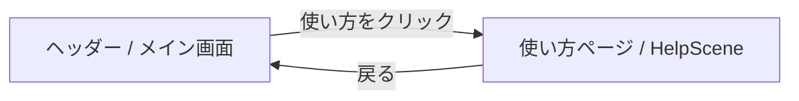

# 要件定義書: 使い方(ヘルプ)ページ

## 背景・目的

アプリを初めて使うユーザーは、ヘッダーやメイン画面に並ぶメニュー項目(新規レシピ、マイページ、モンスター図鑑、ログイン/ログアウト、ガチャ、対戦など)が何をするものか分からない。ユーザーから共有された参考画像(スマートフォン実機の写真に赤い矢印と吹き出しラベルを重ねて、各ボタンの役割を説明するもの)と同じ視覚言語を使い、画面の再現イラスト(モックアップ)に矢印と説明を重ねた**使い方ページ/シーン**を新設する。

Web版(Rails)とGodot版(デスクトップゲームクライアント)の両方に同じ考え方で導入する。

## スコープ

### 含むもの

- Web版: ヘッダーnavへの「使い方」リンク追加、`/help` ページの新設
- Godot版: メイン画面(`Main.tscn`)への「使い方」ボタン追加、`HelpScene` の新設
- 各画面の主要メニュー項目について、矢印+吹き出しで「これは何か」「どう使うか」を初心者向けの短い日本語で説明する静的な解説コンテンツ
- Web版はログイン前後どちらのヘッダー状態でも閲覧可能(ログイン不要)
- Minitestによる自動テスト追加(Web版)

### 含まないもの(対象外)

- アプリ内チュートリアル(初回起動時の自動案内・ステップ実行)
- 各ページ個別のコンテキストヘルプ・ツールチップ
- 動画・アニメーションによる解説
- 日本語以外の多言語対応
- Godot側の自動テスト(既存プロジェクトに自動テスト基盤がないため対象外。手動確認のみ)

## 利用者フロー

**Web版**
1. ヘッダーnavの「使い方」リンクをクリックする(ログイン有無を問わず常に表示)
2. `/help` ページが開き、現在のログイン状態に対応するヘッダーのモックアップに矢印と説明ボックスが重なって表示される
3. ブラウザの戻る操作、または他のnavリンクで元のページに戻る

**Godot版**
1. ログイン後のメイン画面(`Main.tscn`)にある「使い方」ボタンを押す
2. `HelpScene` が開き、メイン画面のボタン配置を再現したモックアップに矢印と説明が重なって表示される
3. 「戻る」ボタンでメイン画面(`Main.tscn`)に戻る

## 画面一覧

| 画面 | URL/シーン | 説明 |
|---|---|---|
| 使い方(Web) | `GET /help` | ヘッダーnavの各項目を矢印+吹き出しで説明する静的ページ |
| 使い方(Godot) | `HelpScene.tscn` | メイン画面の各ボタンを矢印+吹き出しで説明する静的シーン |

## 機能要件

### Web版 `/help`

- `StaticPagesController#help` で処理。ログイン不要(`before_action :require_login` を付けない)
- ログイン後ヘッダーの非活性レプリカ(同じマークアップ/CSSクラスを流用し、クリックできないようにする)に、インラインSVGの矢印と吹き出しボックスを重ねて次の5項目を説明する:
  - ロゴ「レシピ管理」(ホームに戻る)
  - 新規レシピ(レシピを追加する)
  - マイページ(自分の記録を見る)
  - モンスター図鑑(モンスターを見る)
  - ユーザーメニュー(ログアウトする)
- ログイン前ヘッダーのレプリカも別ブロックで用意し、次の2項目を説明する:
  - ログイン(すでに登録した人はこちら)
  - 新規登録(はじめての方はこちら)
- 狭い画面幅では矢印付きモックアップの代わりにテキストリスト表示にフォールバックする
- ヘッダーnavに、ログイン有無に関わらず「使い方」リンクを表示する

### Godot版 `HelpScene`

- メイン画面(`Main.tscn`)の`VBoxContainer`のボタン配置を非活性(押せない・見た目だけ同じ)で再現したモックアップに、矢印(`Line2D`+`Polygon2D`)と吹き出し(`PanelContainer`+`Label`)を重ねて次の項目を説明する:
  - ガチャを回しに行く
  - モンスター図鑑
  - 対戦する
  - ログアウト
  - レベル/EXP表示
- 所持モンスター一覧部分はデータ依存のため、実データではなく固定のプレースホルダ表示にする
- 「戻る」ボタンでメイン画面に戻る(既存の他シーンと同じ`_on_back_pressed`パターン)
- メイン画面に「使い方」ボタンを追加し、押すと`HelpScene`に遷移する

## 非機能要件

- 既存の配色トークン(`--primary`等、`app/assets/stylesheets/application.css`)を踏襲した見た目にする
- 日本語UIで統一する
- 既存のテストスタイル(Minitest、`ActionDispatch::IntegrationTest`、`sign_in_as`ヘルパー)に沿ったテストを追加する
- Godot側は自動テスト基盤がないため、エディタでの手動確認のみ行う

## 画面遷移

## 受け入れ条件(Acceptance Criteria)

- [ ] Web版: 未ログインで `/help` にアクセスでき、200で表示される
- [ ] Web版: ログイン前後どちらのヘッダーにも「使い方」リンクが表示される
- [ ] Web版: `/help` ページに主要メニュー項目(モンスター図鑑、ログインなど)の説明文が含まれる
- [ ] Godot版: メイン画面に「使い方」ボタンがあり、押すと`HelpScene`に遷移する
- [ ] Godot版: `HelpScene`の「戻る」でメイン画面に戻り、EXP/コイン等の状態が保持されている
- [ ] 全自動テスト(Web版)がパスする
